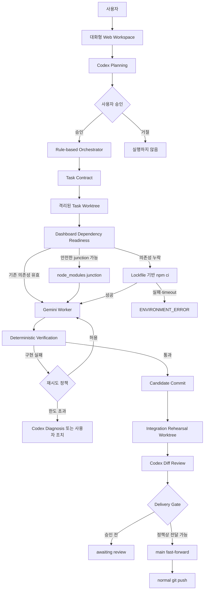
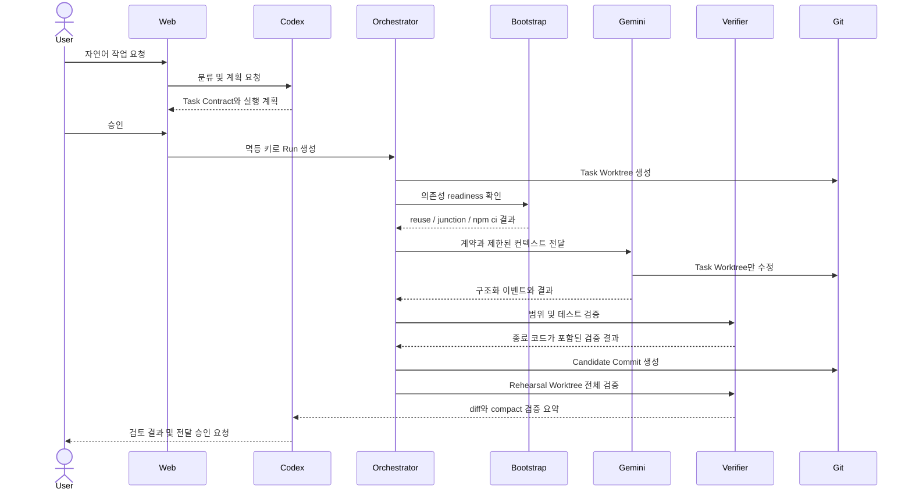
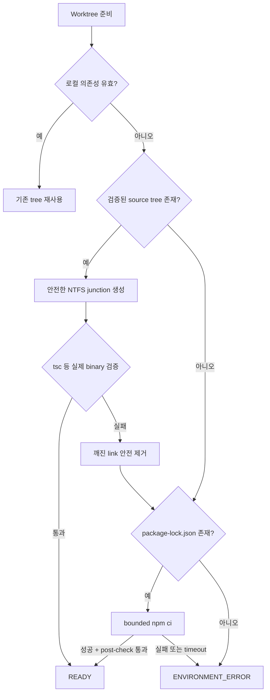
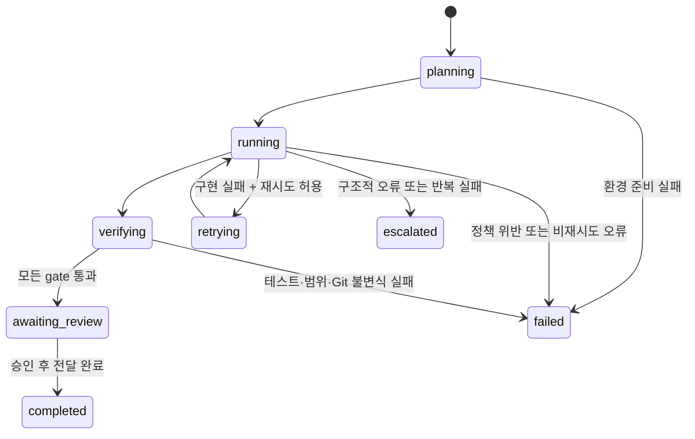

# Codex × Gemini Worker v2 완료 구조와 v2.1 인계 가이드

## 문서 목적

이 문서는 v2 기반 안정화가 끝난 뒤 시스템이 실제로 어떻게 작동하는지 설명하고, 다음 협업자가 v2.1 Filesystem Policy 구현을 바로 시작할 수 있도록 작업 경계와 검증 기준을 제공한다.

함께 읽을 문서:

- [V2_ARCHITECTURE.md](V2_ARCHITECTURE.md): v2 전체 설계
- [FAILURE_ANALYSIS_2026-09-09.md](FAILURE_ANALYSIS_2026-09-09.md): 기존 실패의 원인과 재발 방지 기준
- [V2_1_FILESYSTEM_POLICY.md](V2_1_FILESYSTEM_POLICY.md): 다음 단계의 파일 접근·수정·병합 정책

## 현재 기준선

v2 기반 안정화에는 다음 항목이 포함된다.

- Codex 계획 및 검토와 Gemini 구현 역할 분리
- 격리된 Git worktree에서만 Worker 수정 허용
- 대시보드 의존성 readiness 검사와 결정적 bootstrap
- PowerShell 명령의 제한 시간, 출력 캡처, 프로세스 트리 정리
- 환경 오류와 구현 오류의 분리
- 검증을 통과하기 전 `main`과 원격 저장소 변경 금지
- integration rehearsal 이후에만 전달 가능
- 한글·공백이 포함된 Windows 경로 지원

검증된 기준:

| 검증 | 결과 |
|---|---:|
| Dashboard Node 테스트 | 201 통과 / 0 실패 |
| Bounded Process Runner | 38 통과 / 0 실패 |
| Dependency Bootstrap | 50 통과 / 0 실패 |
| Lint | 통과 |
| Production Build | 통과 |

## v2 완료 후 전체 아키텍처



## 역할 구분

| 구성 요소 | 책임 | 하지 않는 일 |
|---|---|---|
| 사용자 | 요청, 승인, 고위험 최종 결정 | Worker 직접 관리 |
| Codex | 계획, 구조적 진단, diff 검토 | 실행 중 반복 polling |
| Orchestrator | 상태 전이, 작업 순서, 프로세스 실행, 정책 적용 | 코드 품질을 추측으로 판정 |
| Gemini Worker | 격리 worktree의 구현과 지정 검증 | `main` 수정, 원격 push |
| Deterministic Verifier | 범위, 명령 종료 코드, 테스트, 빌드, Git 상태 검사 | 모델 답변을 PASS 근거로 사용 |
| Dashboard | 실제 영속 상태와 이벤트 표시 | 근거 없는 진행 단계 생성 |

## 정상 작업 흐름



## Dashboard Dependency Bootstrap

Worker worktree는 Git이 추적하지 않는 `node_modules`를 자동으로 갖지 않는다. v2는 다음 순서로 의존성을 준비한다.



핵심 불변식:

- `package-lock.json` 없는 임의 설치를 하지 않는다.
- `npm ci`에는 제한 시간을 적용한다.
- 실패한 설치의 자식 프로세스를 남기지 않는다.
- `tsc --help` 같은 placeholder 출력을 실제 컴파일 성공으로 인정하지 않는다.
- 환경 오류는 Gemini 모델 재시도로 해결하려 하지 않는다.

## Bounded Process Runner

모든 fallible 셸 검증은 다음 결과 계약을 가져야 한다.

```json
{
  "status": "PASS | FAIL | TIMED_OUT",
  "exitCode": 0,
  "timedOut": false,
  "durationSeconds": 1.25,
  "output": "sanitized bounded output"
}
```

보장 사항:

- stdin을 즉시 닫아 비대화형 실행의 무한 대기를 방지한다.
- stdout과 stderr를 UTF-8로 캡처한다.
- 최대 출력 길이를 제한한다.
- 토큰, API 키, URL credential, Authorization header를 정제한다.
- timeout 시 Windows 프로세스 트리를 종료한다.
- 부모뿐 아니라 자식과 손자 프로세스의 생존 여부를 확인한다.

## 실패 처리 구조



실패 분류 원칙:

| 분류 | 기본 처리 |
|---|---|
| `ENVIRONMENT_ERROR` | AI 재시도 없이 환경 진단 기록 |
| `PERMISSION_ERROR` | 실제 OS·도구 권한 문제에만 사용 |
| `IMPLEMENTATION_ERROR` | 제한된 Gemini 재시도 가능 |
| `POLICY_VIOLATION` | 즉시 중단, candidate 생성 금지 |
| `REPEATED_FAILURE` | 상위 모델 또는 Codex 진단 |
| `STRUCTURAL_ERROR` | Codex가 계약·설계를 수리한 뒤 재작업 |

## Git 전달 안전성

```text
Worker Diff
  → Candidate Commit
  → Rehearsal Worktree
  → Dependency Bootstrap
  → Scope/Contract/Test/Build 검증
  → Codex Review
  → Delivery Policy
  → main fast-forward
  → deterministic Git checks
  → normal push
```

반드시 지킬 것:

- Worker는 `main`에서 직접 작업하지 않는다.
- Worker는 remote push를 하지 않는다.
- force push를 사용하지 않는다.
- 모든 실패 가능한 검증은 실제 `main` 이동 전에 수행한다.
- candidate commit과 검토 결과를 결합한다.
- remote divergence 또는 충돌이 있으면 전달을 중단한다.
- 검증 실패 후 `main`이나 `origin/main`이 움직이지 않았음을 확인한다.

## v2에서 해결된 주요 실패

### Worktree 의존성 누락

이전에는 새 worktree에 `node_modules`가 없어 TypeScript 검증이 실행되기도 전에 실패했다. 현재는 readiness 검사, junction 재사용, lockfile 기반 `npm ci` fallback으로 처리한다.

### 한글·공백 경로

배치 파일에 한글 절대 경로를 직접 삽입하던 mock 로깅은 Windows OEM 코드페이지에서 깨졌다. 현재는 `%~dp0` 기반 상대 위치를 사용하여 코드페이지 의존성을 제거한다.

### Timeout 이후 프로세스 누출

부모 프로세스만 종료하면 자식 `node`, `npm`, `pwsh`가 남을 수 있었다. 현재는 전체 descendant tree를 종료하고 생존 여부를 검증한다.

### Exit code 0의 가짜 PASS

도구 도움말이나 placeholder가 종료 코드 0을 반환해도 실제 컴파일 증거가 없으면 실패로 처리한다.

## v2 완료 경계

다음 조건을 만족하면 v2 기반 완료로 간주한다.

- [x] 격리 worktree 실행
- [x] Dashboard dependency readiness와 결정적 bootstrap
- [x] bounded shell execution과 프로세스 트리 정리
- [x] UTF-8 및 한글·공백 Windows 경로 검증
- [x] 환경 오류 비재시도 처리
- [x] rehearsal 이전 main 불변성
- [x] Node 테스트, lint, production build 통과
- [x] 셸 회귀 테스트 통과
- [ ] v2.1 Read/Write/Merge Scope 분리
- [ ] Dynamic Write Expansion
- [ ] Protected Test 및 Verifier snapshot
- [ ] 병렬 Worker Write Ownership 검사

마지막 네 항목은 의도적으로 v2.1 범위다.

## 협업자의 v2.1 시작 지점

v2.1의 목표는 Worker가 저장소를 충분히 탐색하도록 허용하면서도 실제 수정과 병합 범위를 결정적으로 제한하는 것이다.

핵심 원칙:

```text
Repository Read Scope
        ≠
Patch Write Scope
        ≠
Integration Merge Scope
```

### 첫 번째 구현 묶음

1. 기존 `allowed_files`를 `write_scope.expected`로 해석하는 하위 호환 계층을 추가한다.
2. `read_scope`, `write_scope`, `merge_scope` 계약 타입을 추가한다.
3. Worker worktree 내부 project-wide search/read를 허용한다.
4. `.env*`, secret, credential, `.git`, 다른 worktree 접근을 실행 환경에서 차단한다.
5. 최종 diff를 Expected, Derived, Sensitive, Forbidden으로 분류하는 순수 함수를 먼저 구현한다.

첫 묶음에서는 자동 범위 확장이나 병렬 ownership까지 한꺼번에 구현하지 않는다.

### 두 번째 구현 묶음

1. `REQUEST_WRITE_EXPANSION` 이벤트 스키마를 추가한다.
2. 직접 dependency 증거만 `ALLOW_DERIVED` 후보로 인정한다.
3. 기존 테스트, 설정, schema, public API는 Sensitive로 보낸다.
4. 승인 결과를 정확한 candidate commit과 결합한다.
5. 승인되지 않은 diff가 integration candidate에 들어가지 않는지 검증한다.

### 세 번째 구현 묶음

1. Protected Test, Verifier, Task Contract, CI/Build Config snapshot을 저장한다.
2. Worker 완료 후 원본 hash와 비교한다.
3. 병렬 Worker의 Write Ownership 충돌을 검사한다.
4. 공용 파일은 sequential 또는 integration-owned task로 전환한다.
5. Compact State와 filesystem telemetry를 추가한다.

## v2.1 변경이 연결될 위치

| 관심사 | 우선 확인 파일 |
|---|---|
| Task Contract와 계획 | `codex-router.ps1`, 계획 스키마 관련 코드 |
| Worker 실행·범위 검증 | `run-parallel-workers.ps1`, `run-gemini-worker.ps1` |
| 제한 시간과 셸 결과 | `bounded-process-runner.ps1` |
| Worktree 의존성 | `dashboard-dependency-bootstrap.ps1` |
| Integration/Delivery Gate | `review-integration.ps1` |
| Dashboard 상태 계약 | `gemini-dashboard/lib/workspace-contract.ts` |
| 영속 Run/Worker 상태 | `gemini-dashboard/lib/workspace-store.ts` |
| 실패·재시도 API | `gemini-dashboard/app/api/runs/`, Node bridge |

## v2.1 필수 테스트

- Initial Context 밖의 정상 source search/read 허용
- Secret 및 denylist 경로 실제 접근 차단
- Expected 파일 수정 허용
- 직접 dependency 증거가 있는 Derived 확장 허용
- 기존 테스트·설정 파일의 자동 확장 거부
- Forbidden 파일 수정 시 candidate 미생성
- 승인되지 않은 diff의 integration 차단
- Protected Test와 Verifier 변경 탐지
- 병렬 Worker ownership 충돌 탐지
- 기존 `allowed_files` 계약 회귀 없음
- 실패·충돌·정책 위반 시 local/remote main 불변
- 한글·공백 경로와 재시작 복구

## v2.1에서 하지 않을 일

- Neural Router 또는 학습 기반 Scheduler
- Repository Memory 전체 재설계
- Multi-Repository 작업
- 사용자 간 실시간 협업
- 조직 단위 권한·과금 시스템
- 자동 Production 배포

## 권장 작업 절차

```text
관련 계약·테스트 확인
  → 작은 Task Contract 작성
  → 한 Worker가 격리 worktree에서 구현
  → targeted tests
  → 셸 회귀 테스트
  → full Node test/lint/build
  → rehearsal integration
  → Codex diff review
  → 사용자 승인 후 main
```

## 인계 체크리스트

협업자는 작업 전에 다음을 확인한다.

- [ ] 최신 `main`을 가져왔다.
- [ ] `pwsh -NoProfile -File ./test-bounded-process-runner.ps1`가 통과한다.
- [ ] `pwsh -NoProfile -File ./test-dependency-bootstrap.ps1`가 통과한다.
- [ ] `npm --prefix gemini-dashboard test`가 통과한다.
- [ ] [V2_1_FILESYSTEM_POLICY.md](V2_1_FILESYSTEM_POLICY.md)의 Tier 0~3 분류를 읽었다.
- [ ] 기존 Verifier나 Protected Test를 Worker 수정 범위에 넣지 않았다.
- [ ] `main` 직접 수정과 Worker remote push를 허용하지 않았다.

## 요약

v2 완료 상태는 “AI Worker가 코드를 수정한다”보다 다음을 보장하는 실행 기반이다.

> 격리된 환경에서 작업하고, 필요한 의존성을 결정적으로 준비하며, 모든 셸 프로세스를 제한 시간 안에 종료하고, 실제 검증 증거가 있을 때만 integration 후보를 만든다.

v2.1은 이 안정된 실행 기반 위에 다음 원칙을 추가한다.

> Worker에게 저장소 탐색 자유는 주되, 수정과 병합은 분류된 범위와 기계적 증거로 통제한다.
